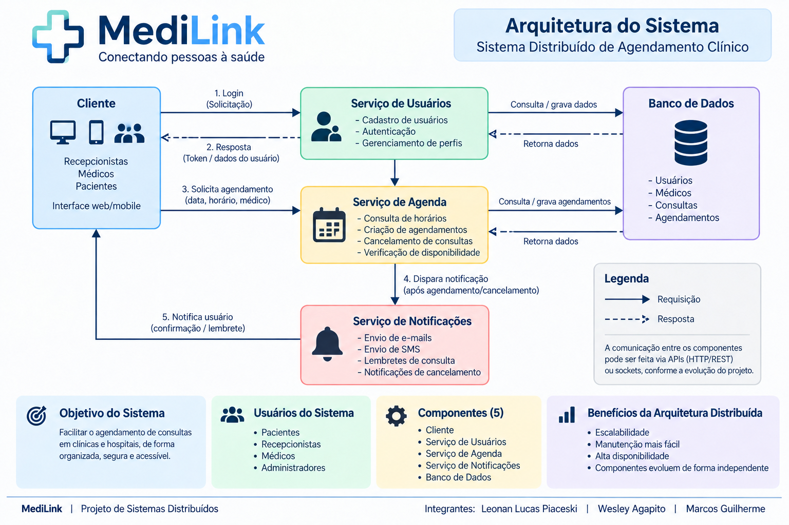

# MediLink

## Sistema Distribuído de Agendamento Clínico

Projeto desenvolvido para a disciplina de **Sistemas Distribuídos**.

### Integrantes
- Leonan Lucas Piaceski
- Wesley Agapito
- Marcos Guilherme

## Checkpoint 01 - Ideia e Arquitetura Inicial

Nesta etapa, o objetivo é definir o problema do sistema, seus usuários, os principais componentes, como eles se comunicam e possíveis situações de falha.

## Problema que será resolvido

O MediLink pretende facilitar o agendamento de consultas em clínicas e hospitais, organizando a comunicação entre os usuários e os serviços responsáveis por autenticação, agenda e notificações.

A proposta é criar uma base organizada para que o sistema possa evoluir durante os próximos checkpoints da disciplina.

## Usuários do sistema

- Pacientes
- Recepcionistas
- Médicos
- Administradores

## Componentes do sistema

A arquitetura inicial do MediLink possui **5 componentes**:

### 1. Cliente
Interface web/mobile utilizada pelos usuários para acessar o sistema.

### 2. Serviço de Usuários
Responsável pelo cadastro de usuários, autenticação e gerenciamento de perfis.

### 3. Serviço de Agenda
Responsável pela consulta de horários, criação de agendamentos, cancelamento de consultas e verificação de disponibilidade.

### 4. Serviço de Notificações
Responsável por confirmações, lembretes e avisos relacionados a agendamentos e cancelamentos.

### 5. Banco de Dados
Responsável pelo armazenamento das informações de usuários, médicos, consultas e agendamentos.

## Arquitetura

## Como os componentes conversam

1. O **Cliente** envia uma solicitação de login ao **Serviço de Usuários**.
2. O **Serviço de Usuários** realiza a autenticação e pode consultar ou gravar informações no **Banco de Dados**.
3. O **Cliente** solicita um agendamento ao **Serviço de Agenda**, informando dados como data, horário e médico.
4. O **Serviço de Agenda** consulta ou grava os dados do agendamento no **Banco de Dados**.
5. Após um agendamento ou cancelamento, o **Serviço de Agenda** pode acionar o **Serviço de Notificações**.
6. O **Serviço de Notificações** envia ao usuário uma confirmação, lembrete ou aviso.

A comunicação poderá utilizar APIs HTTP/REST ou outras formas de comunicação, conforme a evolução do projeto.

## Três situações de falha

### 1. Serviço ou servidor indisponível
O usuário pode não conseguir realizar login, consultar horários ou criar um agendamento enquanto um serviço estiver indisponível.

### 2. Falha ou demora na comunicação
Problemas de rede podem fazer uma solicitação demorar, não chegar ao serviço ou impedir que a resposta retorne ao cliente.

### 3. Banco de Dados indisponível ou inconsistente
O sistema pode não conseguir consultar ou registrar usuários e agendamentos, ou diferentes componentes podem trabalhar temporariamente com informações divergentes.

## Por que o MediLink deveria ser distribuído?

O MediLink possui diferentes responsabilidades, como gerenciamento de usuários, agendamentos, notificações e dados.

Separar essas responsabilidades permite que os componentes possam evoluir de maneira mais independente e facilita aspectos como manutenção, disponibilidade e escalabilidade.

Além disso, a arquitetura distribuída permite estudar problemas importantes da disciplina, como falhas de comunicação, indisponibilidade de serviços e consistência dos dados.

## Observação sobre o Checkpoint 01

A arquitetura apresentada representa o **planejamento inicial do sistema**. Nem todas as funcionalidades mostradas no diagrama precisam estar implementadas nesta etapa.

O desenvolvimento será realizado de forma incremental durante os próximos checkpoints.
